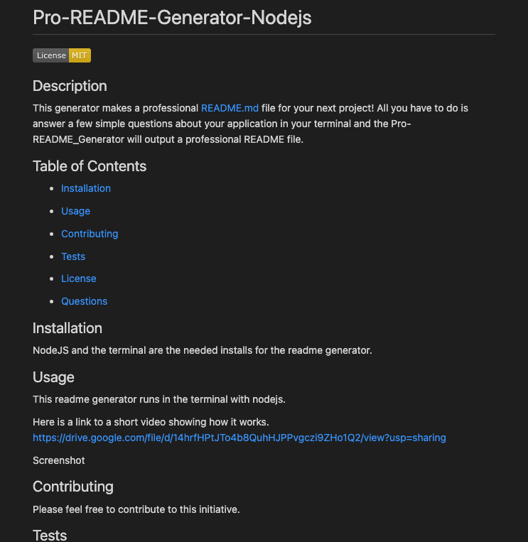

# Pro-README-Generator-Nodejs

## Description

This generator makes a professional README.md file for your next project! All you have to do is answer a few simple questions about your application in your terminal and the Pro-README_Generator will output a professional README file.

## Table of Contents

- [Installation](#installation)

- [Usage](#usage)

- [Contributing](#contributing)

- [Tests](#tests)

- [License](#license)

- [Questions](#questions)

## Installation

NodeJS and the terminal are the needed installs for the readme generator.

## Usage

This readme generator runs in the terminal with nodejs.

Here is a link to a short video showing how it works.
https://drive.google.com/file/d/14hrfHPtJTo4b8QuhHJPPvgczi9ZHo1Q2/view?usp=sharing

Screenshot

## Contributing

Please feel free to contribute to this initiative.

## Tests

No tests have been developed for this application.

## License

This project is covered under the MIT license.

## Questions

Please reach out to me with any questions at hutsonwood@gmail.com. You can also check out my other projects at https://github.com/LHWOOD.
